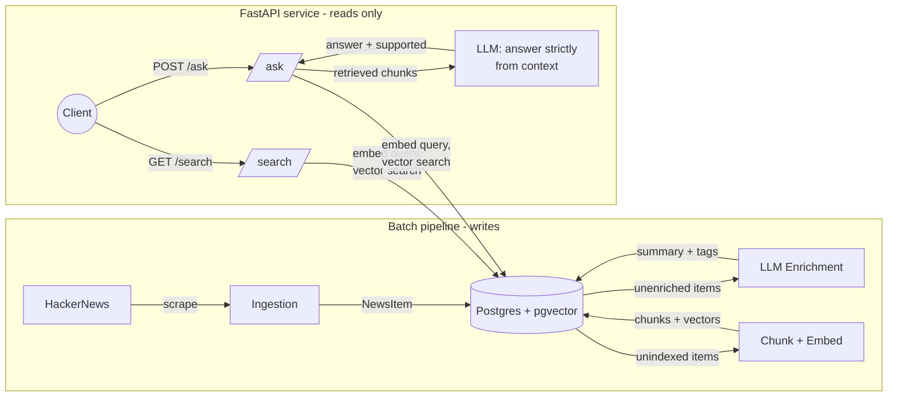

# AI News API

A retrieval-augmented generation (RAG) API over a corpus of scraped AI/tech
news. It answers natural-language questions grounded strictly in what it
actually retrieved — if the evidence doesn't support a confident answer, it
says so instead of guessing. Semantic search, structured LLM output, and
per-IP rate limiting are all backed by a full test suite and a CI pipeline
that runs on every push.

**Live API:** https://ai-news-api-640738486923.europe-west1.run.app/docs

## Why this is interesting

Ask most LLMs a question about a recent event and you get either a
confident-sounding hallucination or a flat "my knowledge cutoff is...".
This project takes the other approach: retrieve real, indexed articles
first, force the model to answer *only* from what was retrieved, and make
the "I don't know" path a first-class response instead of something the
model has to be begged into. The `supported` flag on every answer, and the
fact that citations are only ever returned when `supported` is `true`, is
the whole design in miniature — the API never lets you mistake an unsourced
guess for a grounded fact.

## Architecture



The batch pipeline (`app/pipeline.py`: ingestion → enrichment → indexing)
**writes** to Postgres. The FastAPI service **only reads** from it — it
never scrapes or calls the enrichment agent during a request. `POST /ask/`
is the only route that calls an LLM at request time, and only to synthesize
an answer from chunks that were already retrieved by vector search.

| Layer | Code | Responsibility |
|---|---|---|
| Scraping | `app/scrapers/` | Fetch external data, return `NewsItem` objects |
| LLM calls | `app/agents/` | Embeddings, enrichment, grounded answering — nothing else touches OpenAI |
| Workflows | `app/services/` | `ingestion.py`, `enrichment.py`, `indexing.py` |
| Storage | `app/database/` | SQLAlchemy models, connection, repository (read/write) |
| API | `app/api/routes/` | `health`, `news`, `search`, `ask` — HTTP only, read-only |
| Schema | `app/schemas/news.py` | The one canonical `NewsItem`, shared everywhere |

## Tech stack

- **API:** FastAPI, Pydantic, Uvicorn
- **LLM:** OpenAI API (`text-embedding-3-small` for embeddings, `gpt-4o-mini`
  with structured outputs for grounded answering)
- **Storage:** PostgreSQL + [pgvector](https://github.com/pgvector/pgvector)
  via SQLAlchemy
- **Rate limiting:** slowapi (per-client-IP token bucket)
- **Quality:** pytest + pytest-cov (unit tests, mocked LLM/DB), mypy (strict
  typing), ruff (lint + format)
- **CI/CD:** GitHub Actions, Docker, Google Cloud Run

## How to run locally

Requires Python 3.11+, [uv](https://docs.astral.sh/uv/), Docker (for local
Postgres), and an OpenAI API key.

```bash
# 1. Install dependencies
uv sync

# 2. Configure environment
cp .env.example .env
# fill in OPENAI_API_KEY; DATABASE_URL's default already matches docker-compose.yml

# 3. Start local Postgres + pgvector
docker compose up -d db

# 4. Create tables
uv run python -m app.database.create_tables

# 5. Run the batch pipeline (scrape -> enrich -> index)
uv run python -m app.pipeline

# 6. Run the API
uv run uvicorn app.main:app --reload --port 8001
```

Then open http://localhost:8001/docs for interactive Swagger docs with a
live "Try it out" for every route.

Environment variables (see `.env.example`):

| Variable | Required | Purpose |
|---|---|---|
| `OPENAI_API_KEY` | yes | Embeddings + grounded answering |
| `DATABASE_URL` | yes | Postgres connection string (pgvector-enabled) |

## How to run tests

```bash
# Unit tests (no database or API key needed - everything's mocked)
uv run pytest

# With coverage
uv run pytest --cov=app

# Type checking
uv run mypy app/

# Lint
uv run ruff check .
```

CI (`.github/workflows/ci.yml`) runs pytest on every push. It also has an
opt-in job that drives a real, running instance of the API end-to-end
against a staging database to score retrieval and answer accuracy — kept
opt-in because it spends real OpenAI credits per run and needs a database
that isn't production.

## Example requests

Assumes the API is running locally on port 8001 (`uv run uvicorn
app.main:app --port 8001`); swap in the live URL above to try it without
running anything.

**Health check**

```bash
curl http://localhost:8001/health/
```
```json
{"status": "ok"}
```

**List recent news**

```bash
curl http://localhost:8001/news/
```
```json
[
  {
    "id": 8,
    "source": "hackernews",
    "source_id": "49758580",
    "title": "Saving another 100TB of RAM with math (and Rust)",
    "url": "https://blog.cloudflare.com/saving-100-tb-of-ram-with-math/",
    "author": null,
    "content": "Cloudflare operates at a scale so big that even after working here for years...",
    "scraped_at": "2026-09-18T12:00:00Z",
    "summary": "Cloudflare optimized its memory usage by over 100TB through improvements in their consistent hashing algorithm used in the Pingora Backend Router.",
    "tags": ["Cloudflare", "RAM optimization", "Consistent hashing", "Rust"]
  }
]
```

**Get a single article**

```bash
curl http://localhost:8001/news/8
```
```json
{
  "id": 8,
  "source": "hackernews",
  "source_id": "49758580",
  "title": "Saving another 100TB of RAM with math (and Rust)",
  "url": "https://blog.cloudflare.com/saving-100-tb-of-ram-with-math/",
  "author": null,
  "content": "...",
  "scraped_at": "2026-09-18T12:00:00Z",
  "summary": "...",
  "tags": ["Cloudflare", "RAM optimization", "Consistent hashing", "Rust"]
}
```

**Semantic search** — raw matching chunks, no LLM synthesis

```bash
curl -G http://localhost:8001/search/ \
  --data-urlencode "q=consistent hashing memory savings" \
  --data-urlencode "limit=3"
```
```json
[
  {
    "news_item_id": 8,
    "title": "Saving another 100TB of RAM with math (and Rust)",
    "url": "https://blog.cloudflare.com/saving-100-tb-of-ram-with-math/",
    "chunk_content": "This simple (if wordy) change reduces the amount of memory used for consistent hashing by a whopping 25%!",
    "similarity": 0.83
  }
]
```

**Grounded question answering** — semantic search, then an LLM synthesizes
an answer strictly from the retrieved chunks

```bash
curl -X POST http://localhost:8001/ask/ \
  -H "Content-Type: application/json" \
  -d '{
    "question": "How much RAM did Cloudflare reclaim globally from the consistent-hashing changes to Pingora Backend Router?",
    "limit": 3
  }'
```
```json
{
  "question": "How much RAM did Cloudflare reclaim globally from the consistent-hashing changes to Pingora Backend Router?",
  "answer": "100TB",
  "supported": true,
  "citations": [
    {
      "news_item_id": 8,
      "source_id": "49758580",
      "title": "Saving another 100TB of RAM with math (and Rust)",
      "url": "https://blog.cloudflare.com/saving-100-tb-of-ram-with-math/",
      "chunk_content": "...That allowed us to reclaim more than 100TB of RAM globally, on top of the 100TB of memory the DNS team was able to shed last month..."
    }
  ]
}
```

Ask something the corpus has no evidence for and the response looks like
this instead — no fabricated answer, no citations:

```json
{
  "question": "What was Cloudflare's revenue last quarter?",
  "answer": "Not enough information",
  "supported": false,
  "citations": []
}
```

`POST /ask/` is public and unauthenticated, so it's rate limited to **10
requests/minute per client IP** — a `429` response looks like:

```json
{"error": "Rate limit exceeded: 10 per 1 minute"}
```

## Key engineering decisions

**Citations are only ever populated when `supported` is `true`.**
`search_similar_chunks` can return chunks that are topically close but
don't actually answer the question — that's normal for nearest-neighbor
search. If the LLM judges the retrieved context insufficient and sets
`supported=false`, returning those chunks as "citations" anyway would
misrepresent irrelevant results as sources the answer was built on. So
`app/api/routes/ask.py` gates citation-building on `grounded.supported`,
keeping the contract honest: a citation in the response is a promise that
it was actually used.

**Rate limiting exists because `/ask/` is the one route that spends
money on every call.** Every request does one embedding call plus one
`gpt-4o-mini` call, and the route is public and unauthenticated. Without a
limit, a single client (or a stray retry loop) could run up API costs
indefinitely. slowapi enforces 10 requests/minute per client IP
(`app/api/rate_limit.py`), which is generous enough for interactive use and
`/docs` exploration but blocks casual abuse.

**None-safety is enforced right at the LLM boundary, not scattered
downstream.** OpenAI's structured-output parsing (`client.responses.parse`)
types `output_parsed` as optional even on success, because malformed or
refused responses come back with it unset. `app/agents/answer_agent.py`
checks for `None` and raises immediately, so every caller downstream — the
`/ask/` route, tests, anything built on top of `answer_from_context` — gets
a guaranteed `GroundedAnswer` rather than having to re-check for `None` at
every call site. The `news_item_id` → `NewsItem` lookup used to build
citations gets the same treatment: `get_news_item` can return `None` if the
item was deleted after indexing, and `ask.py` skips that citation rather
than crashing the whole request over one stale reference.

## Frontend

A small Streamlit app (`streamlit_app.py`) provides a UI over `/ask/` and
`/search/` for anyone who'd rather not use curl or `/docs`.

```bash
# from the repo root, with the FastAPI server already running (see above)
uv add streamlit
uv run streamlit run streamlit_app.py
```

By default it talks to `http://localhost:8000`; point it elsewhere with the
`API_BASE_URL` environment variable, e.g.:

```bash
API_BASE_URL=http://localhost:8001 uv run streamlit run streamlit_app.py
```
