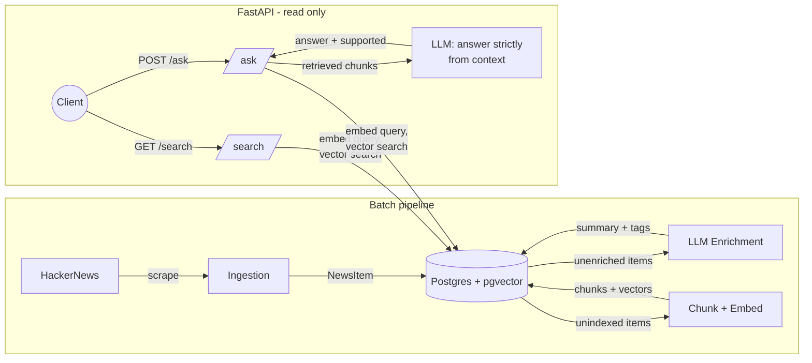

# AI News API

A RAG (retrieval-augmented generation) API over a small corpus of scraped
tech/AI news. It ingests articles, embeds them with pgvector, and answers
natural-language questions grounded strictly in what's actually indexed -
if the retrieved evidence doesn't support an answer, it says so instead of
guessing.

**Live API:** https://ai-news-api-640738486923.europe-west1.run.app/docs

For the real, warts-and-all story of how this was built - including what
broke along the way and what's still rough - see
[PROJECT_JOURNEY.md](./PROJECT_JOURNEY.md).

## Problem statement

Asking an LLM a question about current events either gets a confident,
plausible-sounding hallucination, or a "my knowledge cutoff is..." refusal.
This project is a small, concrete exercise in the alternative: retrieve
real articles first, then force the model to answer only from what was
retrieved, and *measure* whether that actually works rather than assuming
it does.

## Architecture



The batch pipeline (`app/pipeline.py`: ingestion → enrichment → indexing)
**writes** to Postgres. The FastAPI service **only reads** - it never
scrapes or calls the enrichment agent during a request. `/ask/` is the only
route that calls an LLM at request time, and only to synthesize an answer
from chunks that were already retrieved by vector search.

| Layer | Code | Responsibility |
|---|---|---|
| Scraping | `app/scrapers/` | Fetch external data, return `NewsItem` objects |
| LLM calls | `app/agents/` | Enrichment, embeddings, grounded answering - nothing else touches OpenAI |
| Workflows | `app/services/` | `ingestion.py`, `enrichment.py`, `indexing.py` |
| Storage | `app/database/` | SQLAlchemy models, connection, repository (read/write) |
| API | `app/api/routes/` | `health`, `news`, `search`, `ask` - HTTP only, read-only |
| Schema | `app/schemas/news.py` | The one canonical `NewsItem`, shared everywhere |

## Try it

```bash
curl -X POST https://ai-news-api-640738486923.europe-west1.run.app/ask/ \
  -H "Content-Type: application/json" \
  -d '{
    "question": "How much RAM did Cloudflare reclaim globally from the consistent-hashing changes to Pingora Backend Router?",
    "limit": 3
  }'
```

Real response (captured from the live API):

```json
{
  "question": "How much RAM did Cloudflare reclaim globally from the consistent-hashing changes to Pingora Backend Router?",
  "answer": "100TB",
  "supported": true,
  "citations": [
    {
      "news_item_id": 8,
      "source_id": "49758580",
      "title": "Saving another 100TB of RAM with math (and Rust)",
      "url": "https://blog.cloudflare.com/saving-100-tb-of-ram-with-math/",
      "chunk_content": "...That allowed us to reclaim more than 100TB of RAM globally, on top of the 100TB of memory the DNS team was able to shed last month..."
    }
  ]
}
```

(`chunk_content` is truncated above for readability; the real response
returns the full matched chunk for each citation.)

Full interactive docs, with example request/response bodies for every route,
are at [`/docs`](https://ai-news-api-640738486923.europe-west1.run.app/docs).

`POST /ask/` is public and unauthenticated, so it's rate limited to
**10 requests/minute per client IP** (each call spends OpenAI credits: one
embedding + one `gpt-4o-mini` call). See `app/api/rate_limit.py`.

## Evaluation

`week6/evaluations/` is a small harness that drives a running `/ask/`
endpoint with known questions and checks two things per question:
**retrieval** (did it cite the correct source article?) and **answer
correctness** (does the generated answer match, via type-aware
number/boolean/text comparison?).

Latest run, against production data, 30 questions (27 answerable + 3
deliberately unanswerable, expecting `supported: false`):

| Metric | Result |
|---|---|
| Retrieval accuracy | 27/27 (100.0%) |
| Answer accuracy | 29/30 (96.7%) |
| End-to-end accuracy | 29/30 (96.7%) |

**Honest caveat on sample size:** this is 30 questions over 6 articles with
substantial real content (out of 9 ingested - a few only indexed a
JavaScript-required stub, not real article text). That's enough to catch
real regressions and real retrieval failures - the harness did, in fact,
catch a genuine retrieval-recall miss during the last run - but it's not a
large or statistically rigorous benchmark. See
[PROJECT_JOURNEY.md](./PROJECT_JOURNEY.md) for what that failure actually
was and why it wasn't papered over.

Run it yourself against a running instance:

```bash
uv run python -m week6.evaluations.run_evaluation --base-url http://localhost:8001
```

## Setup

Requires Python 3.11+, [uv](https://docs.astral.sh/uv/), Docker (for local
Postgres), and an OpenAI API key.

```bash
# 1. Install dependencies
uv sync

# 2. Configure environment
cp .env.example .env
# fill in OPENAI_API_KEY and DATABASE_URL (docker-compose default shown below works as-is)

# 3. Start local Postgres + pgvector
docker compose up -d db

# 4. Create tables
uv run python -m app.database.create_tables

# 5. Run the batch pipeline (scrape -> enrich -> index)
uv run python -m app.pipeline

# 6. Run the API
uv run uvicorn app.main:app --reload --port 8001
```

Then open http://localhost:8001/docs, or run the test suite (no database or
API key required - everything's mocked):

```bash
uv run python -m unittest discover
```

## Tech stack

Python 3.11+, [uv](https://docs.astral.sh/uv/), FastAPI, Pydantic,
SQLAlchemy, PostgreSQL + [pgvector](https://github.com/pgvector/pgvector),
OpenAI API (`text-embedding-3-small`, `gpt-4o-mini`), slowapi, Docker,
Google Cloud Run.
